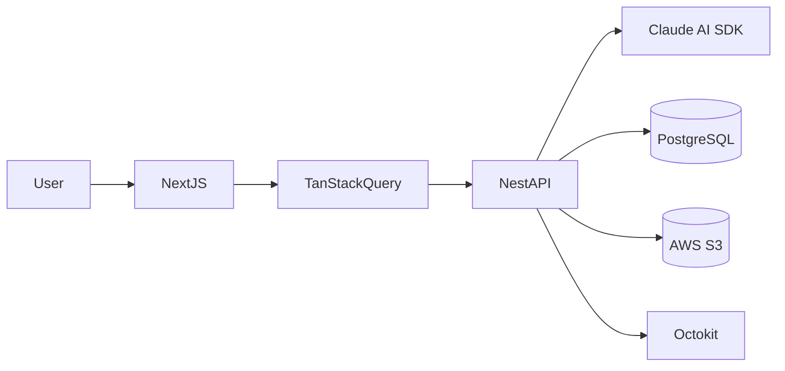
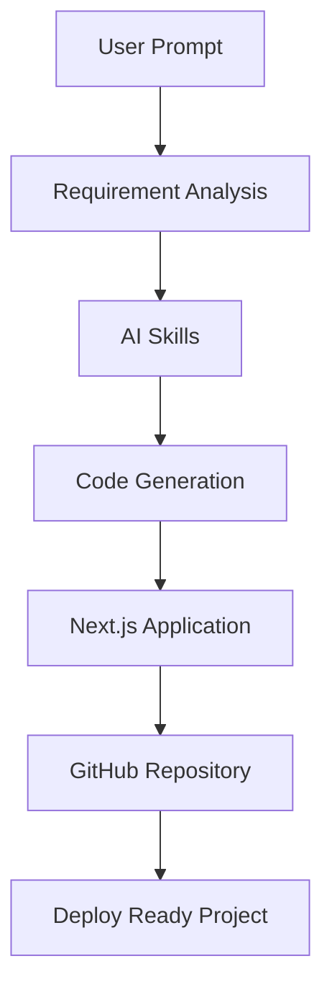
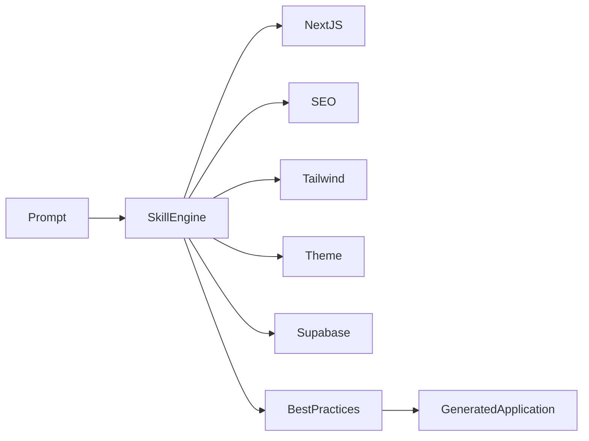
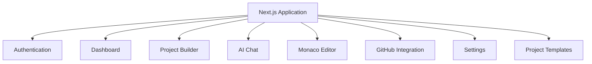
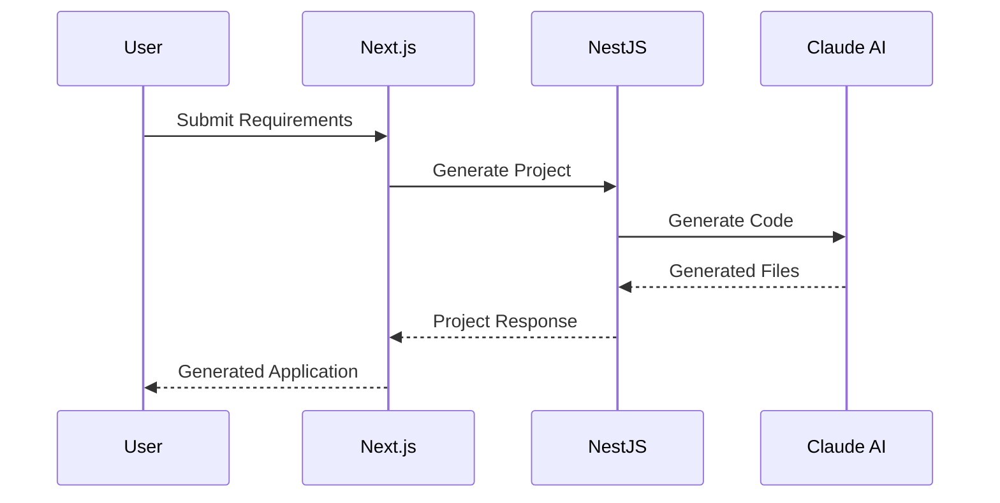

# 🚀 Fullstack AI Builder

### AI-Powered Full Stack Application Generation Platform

Transform natural language requirements into production-ready full-stack applications using AI, reusable engineering skills, and standardized development workflows.

---

### 🤖 AI-Native Full Stack Development Platform

An AI-powered platform that generates production-ready full-stack applications from natural language requirements using intelligent code generation, reusable AI engineering skills, and standardized development workflows.

---

# 📑 Table of Contents

- Overview
- Demo
- Features
- Tech Stack
- Platform Workflow
- AI Generation Pipeline
- Frontend Architecture
- AI Skill System
- GitHub Integration
- My Contributions
- Engineering Highlights
- Performance Improvements

---

# 🎥 Product Demonstration

## 🖥 Platform Walkthrough

[platform-demo.mp4](https://drive.google.com/file/d/1vXQB7pvZEG-y7V0vL8hS5voD5f6f8Tg-/view?usp=sharing)

---

# 🌟 Overview

This project is an AI-powered Full Stack Application Builder that transforms user requirements into production-ready web applications through intelligent code generation.

Instead of manually creating boilerplate projects, configuring frameworks, writing repetitive code, and establishing best practices, the platform leverages AI agents and reusable engineering skills to automatically generate scalable applications.

My primary responsibility was building frontend features, architecting reusable AI skills, defining engineering standards, and integrating AI generation workflows into the platform. The platform is designed to accelerate application development through AI-assisted automation and reusable code generation patterns. :contentReference[oaicite:1]{index=1}

---

# ✨ Key Features

## 🤖 AI Application Generation

- Natural Language → Full Stack Application
- AI-assisted code generation
- Intelligent project scaffolding
- Standardized engineering practices
- Reusable AI workflows

---

## 🧠 AI Skills Library

Developed reusable AI Skills consumed by every generated application.

Examples include:

- Next.js Best Practices
- Supabase Integration
- SEO Optimization
- Tailwind CSS Standards
- shadcn/ui Components
- Local SEO
- Theme System
- Frontend Architecture Standards

---

## ⚡ Code Quality Automation

- Standardized project structure
- Best practice enforcement
- Reusable architecture
- Optimized routing
- Performance-first generation

---

## 📂 GitHub Integration

- Repository generation
- Source code synchronization
- Version management
- GitHub automation
- Project publishing

---

## 📝 Rich Code Editing

- Monaco Editor
- Intelligent editing experience
- Syntax highlighting
- Project customization

---

# 🛠 Tech Stack

| Category | Technologies |
|----------|--------------|
| Frontend | Next.js |
| Language | TypeScript |
| Styling | Tailwind CSS |
| UI | shadcn/ui |
| State Management | TanStack Query |
| Backend | NestJS |
| Database | PostgreSQL |
| Storage | AWS S3 |
| AI | Claude AI SDK |
| Editor | Monaco Editor |
| GitHub | Octokit |

---

# 🏗 High-Level Architecture

---

# 🤖 AI Generation Pipeline

---

# 🧠 AI Skills Workflow

---

## 🌐 Frontend Architecture

---

# ⚡ API Communication

---

# 📦 AI Skill Ecosystem

The platform consumes reusable engineering skills to ensure every generated application follows consistent engineering practices.

Implemented Skills

- ✅ Next.js Best Practices
- ✅ SEO Optimization
- ✅ Tailwind Standards
- ✅ shadcn/ui Components
- ✅ Theme System
- ✅ Local SEO
- ✅ Supabase Integration
- ✅ Engineering Standards

---

# 👨‍💻 My Contributions

I primarily contributed to the frontend platform, AI engineering workflows, and reusable generation capabilities.

### Frontend Engineering

- Built production frontend using Next.js
- TypeScript development
- Custom Hooks architecture
- TanStack Query integration
- Component architecture
- Dashboard development
- AI generation interface
- Monaco Editor integration
- GitHub integration using Octokit
- AWS S3 integrations
- Responsive UI
- Error handling
- Performance optimization

---

### AI Engineering

- Engineered 8+ reusable AI Skills
- Built reusable engineering standards
- Defined AI prompt workflows
- Improved generated application quality
- Standardized generated project architecture

---

### Performance Improvements

Implemented multiple optimizations across generated applications.

- 🚀 Lighthouse SEO improved to approximately **92–96/100**
- 🚀 Reduced initial JavaScript bundle size by approximately **20%**
- 🚀 Near-instant navigation using Next.js route prefetching
- 🚀 Eliminated redundant API calls using Context API
- 🚀 Standardized frontend architecture across AI-generated applications

---

# 📈 Engineering Highlights

✅ AI-assisted Full Stack Development

✅ Claude AI SDK Integration

✅ Intelligent Code Generation

✅ Engineering Skill System

✅ Next.js Architecture Standards

✅ GitHub Automation

✅ SEO Optimization

✅ Performance Optimization

✅ Modular Component Design

✅ Scalable Frontend Architecture

---

# 🙏 Acknowledgements

This repository showcases my frontend engineering contributions to an AI-powered Full Stack Application Builder.

My focus areas included:

- Frontend Architecture
- AI-assisted Development
- Reusable Engineering Skills
- Performance Optimization
- AI Generation Workflows
- Developer Experience
- Engineering Standards

---

### ⭐ Thank you for visiting this repository.

Building the future of AI-assisted software engineering.

